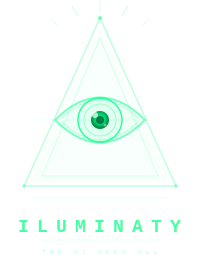

<p align="center">
  
</p>

<h1 align="center">ILUMINATY</h1>

<p align="center">
  <strong>Real-time visual perception + action for AI. Zero-disk. RAM-only. Universal.</strong>
</p>

<p align="center">
  
  
  
  
  
  
</p>

<p align="center">
  <em>Give any AI eyes AND hands on your computer. Not screenshots. Live perception + real action.</em>
</p>

---

## The Problem

Every AI today is **blind between screenshots** and **can't touch anything**. You manually take a screenshot, paste it, wait for analysis, then manually do what the AI suggests. The AI can see (poorly) but can never act.

## The Solution

ILUMINATY gives AI **persistent vision + direct action** — a lightweight daemon that captures your screen in real-time, understands the UI through accessibility trees, and can control the computer through 7 layers of intelligent cascading actions.

```
Your Screen ──→ Capture ──→ Ring Buffer (RAM) ──→ API ──→ Any AI
                  │              │                  │
                  ├ Adaptive FPS  ├ Zero disk        ├ REST + WebSocket
                  ├ WebP/JPEG/PNG ├ Auto-eviction    ├ MCP Protocol (17 tools)
                  ├ Smart quality  ├ ~2MB for 30s     ├ Python/Node SDK
                  └ Multi-monitor  └ Dies on exit     └ 80+ endpoints

AI Instruction ──→ Intent ──→ Resolver ──→ Action ──→ Verify ──→ Recover
                    │           │            │          │          │
                    ├ NLP parse  ├ API Direct  ├ Mouse    ├ File check ├ Retry
                    ├ 30+ patterns├ Keyboard   ├ Keyboard ├ DOM check  ├ Alternative
                    └ Bilingual   ├ UI Tree    ├ Browser  ├ UI check   └ Escalate
                                  └ Vision/OCR └ Terminal
```

When the process dies, **everything disappears**. No traces. No recovery. Privacy by destruction.

## Features

### Vision (v0.5)
| Feature | Description |
|---|---|
| Screen capture | Adaptive FPS (0.2-5.0), WebP/JPEG/PNG, 36KB/frame |
| OCR | RapidOCR engine, 91% accuracy, 114+ text blocks |
| Visual diff | Grid 8x6 change detection with heatmap |
| Spatial map | Knows WHERE things are on screen (OCR + UI Tree) |
| Multi-monitor | 3+ monitors with smart FPS routing |
| Annotations | Draw rect/circle/arrow/text on live stream |

### Computer Use (v1.0) — 7 Layers, 42+ Actions
| Layer | Module | What It Does |
|---|---|---|
| **Capa 1: OS Control** | `actions.py` | 16 mouse/keyboard actions: click, double_click, right_click, drag_drop, type_text (unicode), hotkey, press/hold/release key, scroll |
| | `windows.py` | Window manager: list, focus, minimize, maximize, close, move, resize |
| | `clipboard.py` | Clipboard: read, write, history (50 entries) |
| | `process_mgr.py` | Process manager: list, find, launch, terminate, kill |
| **Capa 2: UI Intelligence** | `ui_tree.py` | Accessibility Tree: find buttons, fields, menus by NAME not pixels. Windows (UIAutomation), macOS (AppleScript), Linux (AT-SPI) |
| **Capa 3: App Control** | `vscode.py` | VS Code commands: open files, execute any command, diff, extensions |
| | `terminal.py` | Terminal PTY: run commands, background processes, output streaming |
| | `git_ops.py` | Git: status, diff, log, commit, push, pull, branch, stash |
| **Capa 4: Web** | `browser.py` | Chrome DevTools Protocol: DOM, click selectors, fill forms, navigate, tabs, JS eval |
| **Capa 5: File System** | `filesystem.py` | Sandboxed file access: read, write, search, delete with path restrictions + auto-backup |
| **Capa 6: Brain** | `resolver.py` | Cascade resolver: API Direct > Keyboard > UI Tree > Vision (always tries fastest first) |
| | `intent.py` | NLP intent classifier: 30+ bilingual patterns (ES/EN), no LLM needed |
| | `planner.py` | Task decomposer: complex tasks → sub-actions with dependencies |
| | `verifier.py` | Post-action verification: confirms the action actually worked |
| | `recovery.py` | Error recovery: retry → alternative → rollback → escalate |
| **Capa 7: Safety** | `safety.py` | Kill switch, whitelist/blacklist, rate limits per category (safe/normal/destructive/system) |
| | `autonomy.py` | 3 levels: SUGGEST (read-only), CONFIRM (human-in-loop), AUTO (self-executing safe+normal) |
| | `audit.py` | Persistent SQLite audit log with rotation, indexed queries |

### Audio
| Feature | Description |
|---|---|
| Mic capture | Cross-platform via sounddevice |
| System audio | Capture what the computer plays |
| VAD | Voice Activity Detection (speech vs silence) |
| Transcription | Whisper local engine (optional) |

### Intelligence
| Feature | Description |
|---|---|
| Context engine | 9 workflow types: coding, browsing, meeting, designing... |
| Focus tracking | HIGH/MEDIUM/LOW based on app switch frequency |
| Proactive watchdog | 8 triggers: errors, build fails, security warnings |
| Multi-modal fusion | Unifies vision + audio + context + agent state in one prompt |
| AI router | Auto-selects cheapest model. 80% cost savings |

### Privacy & Security
| Feature | Description |
|---|---|
| Zero disk | RAM-only ring buffer. Nothing ever written to storage |
| Auto-blur | Passwords, credit cards, emails, API keys blurred before AI sees them |
| Kill switch | Instantly halt all agent actions |
| 3-level autonomy | SUGGEST / CONFIRM / AUTO with per-action category permissions |
| Audit log | Persistent log of every action: what, when, result, autonomy level |
| Rate limiting | Per-category: safe (60/min), normal (20/min), destructive (3/min), system (1/min) |
| Process death = data death | Kill the process, everything is gone |

### Integrations
| Feature | Description |
|---|---|
| AI adapters | Gemini Live, OpenAI, Claude, Generic |
| MCP server | 17 tools for Claude Code / Cursor |
| REST API | 80+ endpoints |
| WebSocket | Live frame streaming |
| Plugin system | Event-driven with auto-load |
| Collaborative | Shared rooms with annotations |

## Quick Start

### Option 1: Portable executable (recommended)
```
Download ILUMINATY.exe → Double click → Done.
No Python. No dependencies. No terminal.
```

### Option 2: From source
```bash
git clone https://github.com/sgodoy90/iluminaty.git
cd iluminaty
pip install -e ".[ocr]"
python main.py start
# Open http://localhost:8420
```

### Option 3: With actions enabled (Computer Use)
```bash
python main.py start --actions --autonomy confirm --fps 2
# AI can now see AND act (with confirmation)
```

### Option 4: Connect to Claude Code (MCP)
```bash
claude mcp add iluminaty -- python /path/to/iluminaty/iluminaty/mcp_server.py
# Then ask: "click the Save button" or "run npm test"
```

## What the AI Receives

ILUMINATY doesn't just send pixels. It sends an **enriched perception + action package**:

```
## Live Screen Perception - 2026-03-29 17:15:42
**User is coding** in VS Code | Focus: HIGH | Silent | 3 monitor(s)

### ALERTS (action may be needed)
- **[ERROR]** detected: build failed at line 42

**Window**: main.py - iluminaty - Visual Studio Code

### Visible Text (114 blocks, 91% confidence)
[OCR extracted text here]

### Recent Speech
> "Can you fix the import error on line 15?"

### Screen Layout
- top-left: code content (25% of screen)
- bottom-left: terminal content (25%)
- button:Save: ui (1.2% of screen)
- textfield:Search: text (2.0% of screen)

### Agent Capabilities
**Autonomy**: CONFIRM | **Actions**: ENABLED | **Safety**: OK
Mode: CONFIRM — I can act but need confirmation for each action.

**Recent actions**:
  - click: OK (17:15:30)
  - type_text: OK (17:15:28)

### How to Help
An image of the current screen is attached.
You have full visual, audio, and contextual awareness.
You can also TAKE ACTIONS on the computer: click, type,
open apps, manage windows, run commands, navigate browser,
read/write files, and more. Use the do_action tool.
```

## API Reference

### Vision
| Method | Path | Description |
|---|---|---|
| GET | `/vision/snapshot` | Enriched frame: image + OCR + context + prompt |
| GET | `/vision/ocr` | OCR text (full screen or region) |
| GET | `/vision/diff` | What changed and where (grid + heatmap) |
| GET | `/vision/window` | Active window info |

### Frames
| Method | Path | Description |
|---|---|---|
| GET | `/frame/latest` | Latest frame (raw image) |
| GET | `/frame/latest?base64` | Latest frame (base64 JSON) |
| GET | `/frame/annotated` | Frame with annotations overlay |
| GET | `/frames?last=5` | Last N frames |

### Actions (v1.0)
| Method | Path | Description |
|---|---|---|
| POST | `/action/click` | Mouse click at coordinates |
| POST | `/action/double_click` | Double click |
| POST | `/action/type` | Type text (unicode) |
| POST | `/action/hotkey` | Keyboard shortcut (e.g. ctrl+s) |
| POST | `/action/scroll` | Scroll up/down |
| POST | `/action/drag` | Drag and drop |
| GET | `/action/mouse` | Current mouse position |
| GET | `/action/status` | Action bridge status |
| POST | `/action/enable` | Enable actions |
| POST | `/action/disable` | Disable actions |
| GET | `/action/log` | Recent action log |

### Windows (v1.0)
| Method | Path | Description |
|---|---|---|
| GET | `/windows/list` | List all visible windows |
| GET | `/windows/active` | Active window info |
| POST | `/windows/focus` | Focus window by title |
| POST | `/windows/minimize` | Minimize window |
| POST | `/windows/maximize` | Maximize window |
| POST | `/windows/close` | Close window |
| POST | `/windows/move` | Move/resize window |

### Clipboard (v1.0)
| Method | Path | Description |
|---|---|---|
| GET | `/clipboard/read` | Read clipboard |
| POST | `/clipboard/write` | Write to clipboard |
| GET | `/clipboard/history` | Clipboard history |

### Process Manager (v1.0)
| Method | Path | Description |
|---|---|---|
| GET | `/process/list` | List running processes |
| GET | `/process/find` | Find process by name |
| POST | `/process/launch` | Launch application |
| POST | `/process/terminate` | Terminate process |

### UI Tree (v1.0)
| Method | Path | Description |
|---|---|---|
| GET | `/ui/elements` | List all UI elements (accessibility tree) |
| GET | `/ui/find` | Find element by name/role |
| GET | `/ui/find_all` | Find all matching elements |
| POST | `/ui/click` | Click element by name |
| POST | `/ui/type` | Type in field by name |

### VS Code (v1.0)
| Method | Path | Description |
|---|---|---|
| POST | `/vscode/command` | Execute VS Code command |
| POST | `/vscode/open` | Open file in VS Code |

### Terminal (v1.0)
| Method | Path | Description |
|---|---|---|
| POST | `/terminal/exec` | Run command (sync) |
| POST | `/terminal/background` | Run command (async) |
| GET | `/terminal/background/{name}` | Background command status |
| GET | `/terminal/history` | Command history |

### Git (v1.0)
| Method | Path | Description |
|---|---|---|
| GET | `/git/status` | Repository status |
| GET | `/git/log` | Commit log |
| GET | `/git/diff` | Show diff |
| POST | `/git/commit` | Stage + commit |
| POST | `/git/push` | Push to remote |
| POST | `/git/pull` | Pull from remote |

### Browser (v1.0)
| Method | Path | Description |
|---|---|---|
| GET | `/browser/tabs` | List browser tabs |
| POST | `/browser/navigate` | Navigate to URL |
| POST | `/browser/click` | Click DOM element by CSS selector |
| POST | `/browser/fill` | Fill input field |
| GET | `/browser/text` | Get page text content |
| POST | `/browser/eval` | Execute JavaScript |

### File System (v1.0)
| Method | Path | Description |
|---|---|---|
| GET | `/files/read` | Read file (sandboxed) |
| POST | `/files/write` | Write file (auto-backup) |
| GET | `/files/list` | List directory |
| GET | `/files/search` | Search files by pattern + content |
| DELETE | `/files/delete` | Delete file |

### Agent Brain (v1.0)
| Method | Path | Description |
|---|---|---|
| POST | `/agent/do` | Intent-based action (natural language) |
| POST | `/agent/plan` | Create execution plan (dry run) |
| GET | `/agent/plans` | List plans |
| GET | `/agent/status` | Full agent status |

### Safety (v1.0)
| Method | Path | Description |
|---|---|---|
| GET | `/safety/status` | Safety + autonomy + audit status |
| POST | `/safety/kill` | KILL SWITCH: halt all actions |
| POST | `/safety/resume` | Resume after kill |
| GET | `/safety/whitelist` | View action whitelist |
| POST | `/autonomy/level` | Change autonomy level |
| GET | `/audit/recent` | Recent audit entries |
| GET | `/audit/failures` | Recent failures |

### Audio
| Method | Path | Description |
|---|---|---|
| GET | `/audio/stats` | Audio buffer stats |
| GET | `/audio/level` | Real-time VU meter |
| GET | `/audio/transcribe?seconds=10` | Transcribe recent audio |
| GET | `/audio/devices` | List audio devices |

### Context
| Method | Path | Description |
|---|---|---|
| GET | `/context/state` | Current workflow + focus level |
| GET | `/context/apps` | Time per app |
| GET | `/context/workflows` | Time per workflow type |
| GET | `/context/timeline` | Activity timeline |

### Watchdog
| Method | Path | Description |
|---|---|---|
| GET | `/watchdog/alerts` | Active alerts |
| GET | `/watchdog/triggers` | Configured triggers |
| POST | `/watchdog/scan` | Manual scan |

### Control
| Method | Path | Description |
|---|---|---|
| GET | `/` | Live dashboard |
| GET | `/health` | Health check |
| GET | `/system/overview` | All components status |
| GET | `/buffer/stats` | Buffer statistics |
| GET | `/monitors` | Monitor info |
| GET | `/plugins` | Loaded plugins |
| POST | `/config` | Change settings live |
| POST | `/buffer/flush` | Destroy all visual data |

## MCP Tools (17)

### Vision (7 original)
| Tool | Description |
|---|---|
| `see_screen` | Enriched screenshot with OCR + context |
| `see_changes` | What changed in the last N seconds |
| `annotate_screen` | Mark an area on screen |
| `read_screen_text` | OCR the screen or a region |
| `screen_status` | System status |
| `get_context` | User workflow + focus level |
| `get_audio_level` | Audio level + speech detection |

### Computer Use (10 new)
| Tool | Description |
|---|---|
| `do_action` | Natural language action: "save the file", "click Submit", "type hello" |
| `click_element` | Click UI element by name (accessibility tree) |
| `type_text` | Type text with keyboard (unicode) |
| `run_command` | Execute shell command |
| `list_windows` | List all desktop windows |
| `find_ui_element` | Find UI element by name/role |
| `read_file` | Read file content (sandboxed) |
| `write_file` | Write file content (sandboxed) |
| `get_clipboard` | Read clipboard |
| `agent_status` | Full agent capabilities status |

## SDKs

### Python
```python
from iluminaty_client import Iluminaty

eye = Iluminaty()

# See
snapshot = eye.see()           # see the screen
text = eye.read()              # OCR text
diff = eye.what_changed()      # visual diff
ctx = eye.what_doing()         # user workflow

# Act (v1.0)
eye.post("/action/click", x=500, y=300)
eye.post("/action/type", text="hello world")
eye.post("/agent/do", instruction="save the file")
eye.post("/terminal/exec", cmd="npm test")
eye.get("/windows/list")

# Ask AI
answer = eye.ask("gemini", "What error?", api_key="...")
```

### Node.js
```typescript
import { Iluminaty } from 'iluminaty';

const eye = new Iluminaty();

// See
const snapshot = await eye.see();
const text = await eye.read();

// Act (v1.0)
await eye.post('/agent/do', { instruction: 'save the file' });
await eye.post('/action/click', { x: 500, y: 300 });
await eye.post('/terminal/exec', { cmd: 'npm test' });
```

## CLI Options

```
python main.py start [OPTIONS]

# Core
--port 8420              API port
--host 127.0.0.1         Localhost only (default)
--fps 1.0                Target FPS
--buffer-seconds 30      Ring buffer duration
--quality 80             Image quality (10-95)
--format webp            Image format (webp/jpeg/png)
--max-width 1280         Max frame width
--monitor 1              Monitor (0=all, 1=primary)
--api-key KEY            Authentication key
--no-adaptive            Disable adaptive FPS
--no-smart-quality       Disable smart quality

# Audio
--audio off              Audio (off/mic/system/all)
--audio-buffer 60        Audio buffer seconds

# Computer Use (v1.0)
--actions                Enable action bridge (mouse/keyboard control)
--autonomy suggest       Autonomy level: suggest / confirm / auto
--browser-debug-port 9222  Chrome DevTools debug port
--file-sandbox PATH...   Allowed file system paths for sandbox
```

## Architecture

```
iluminaty/                         42 modules (~12,000+ LOC)
│
├── Core (v0.5 — Perception)
│   ├── ring_buffer.py             RAM-only circular buffer
│   ├── capture.py                 Screen capture engine (mss + PIL)
│   ├── vision.py                  OCR + annotations + auto-blur
│   ├── smart_diff.py              Grid-based visual diff + heatmap
│   ├── audio.py                   Audio capture + VAD + transcription
│   ├── context.py                 Workflow detection + focus tracking
│   ├── watchdog.py                Proactive alerts (8 triggers)
│   ├── spatial.py                 Screen layout mapping + UI Tree
│   ├── profile.py                 User preference learning
│   ├── fusion.py                  Multi-modal fusion + agent state
│   ├── router.py                  AI model cost optimizer
│   ├── relay.py                   E2E encrypted cloud relay
│   ├── collab.py                  Collaborative shared sessions
│   ├── adapters.py                AI providers (Gemini/OpenAI/Claude)
│   ├── security.py                Auth + rate limit + sensitive detection
│   ├── plugin_system.py           Event-driven plugin architecture
│   ├── monitors.py                Multi-monitor management
│   ├── memory.py                  Optional temporal memory
│   └── dashboard.py               Professional live web UI
│
├── Capa 1: OS Control (v1.0)
│   ├── actions.py                 16 mouse/keyboard actions + UI Tree hooks
│   ├── windows.py                 Window management (cross-platform)
│   ├── clipboard.py               Clipboard with history
│   └── process_mgr.py             Process management
│
├── Capa 2: UI Intelligence (v1.0)
│   └── ui_tree.py                 Accessibility Tree (UIAutomation/AppleScript/AT-SPI)
│
├── Capa 3: App Control (v1.0)
│   ├── vscode.py                  VS Code command bridge
│   ├── terminal.py                Terminal PTY + background processes
│   └── git_ops.py                 Git operations wrapper
│
├── Capa 4: Web (v1.0)
│   └── browser.py                 Chrome DevTools Protocol
│
├── Capa 5: File System (v1.0)
│   └── filesystem.py              Sandboxed file access
│
├── Capa 6: Brain (v1.0)
│   ├── resolver.py                Action cascade: API > KB > UI > Vision
│   ├── intent.py                  NLP intent classifier (30+ patterns)
│   ├── planner.py                 Task decomposer with dependencies
│   ├── verifier.py                Post-action verification
│   └── recovery.py                Error recovery with escalation
│
├── Capa 7: Safety (v1.0)
│   ├── safety.py                  Kill switch + whitelist + rate limits
│   ├── autonomy.py                3 autonomy levels + per-app overrides
│   └── audit.py                   Persistent SQLite audit log
│
├── Server
│   ├── server.py                  FastAPI (80+ endpoints + WebSocket)
│   ├── mcp_server.py              MCP protocol (17 tools)
│   └── main.py                    CLI entry point
│
└── SDKs
    ├── sdk/python/                Python SDK
    └── sdk/node/                  Node.js SDK
```

## Performance

| Metric | Value |
|---|---|
| RAM (30s video buffer) | ~2 MB |
| RAM (60s audio buffer) | ~0.3 MB |
| CPU (1 fps) | ~2-3% |
| Frame size (WebP q80) | ~36 KB |
| Frame efficiency | ~80% dropped (no change) |
| OCR accuracy | 91% |
| Action speed (API direct) | <10ms |
| Action speed (keyboard) | ~50ms |
| Action speed (UI Tree) | ~100ms |
| Action speed (vision/OCR) | ~500ms |
| Disk usage | **ZERO** |
| Modules | 42 |
| API endpoints | 80+ |
| MCP tools | 17 |

## Platform Support

| OS | Screen | Audio | Window Mgmt | UI Tree | Status |
|---|---|---|---|---|---|
| Windows | DXGI | sounddevice | ctypes/user32 | UIAutomation | Tested |
| macOS | CoreGraphics | sounddevice | AppleScript | AXUIElement | Supported |
| Linux (X11) | XShm | sounddevice | wmctrl/xdotool | AT-SPI | Supported |

## What Makes This Different

| | Screenshots | Screenpipe | Computer Use (Anthropic) | ILUMINATY |
|---|---|---|---|---|
| **Mode** | Manual | Records everything | API screenshots | **Live perception + action** |
| **Storage** | Disk | ~20GB/month | Cloud | **ZERO (RAM only)** |
| **Actions** | None | None | Click/type/scroll | **42+ actions, 7 layers** |
| **UI Understanding** | None | None | Screenshots + OCR | **Accessibility Tree + OCR + pixel** |
| **Error Recovery** | None | None | None | **Auto retry + cascade + escalate** |
| **Speed** | Seconds | Seconds | 1-3s per action | **<10ms (API) to 500ms (vision)** |
| **Safety** | N/A | N/A | Basic sandbox | **3 autonomy levels + kill switch + audit** |
| **Privacy** | Files on disk | SQLite DB | Cloud API | **RAM only, dies on exit** |
| **Cost** | Free | $30+ | API pricing | **Free & open source** |

## License

MIT

---

<p align="center">
  
  <br/>
  <em>The AI sees all. Now it can do all.</em>
</p>
